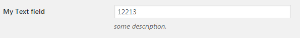
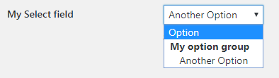
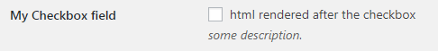
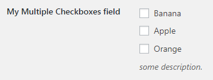
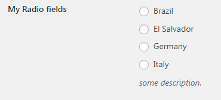
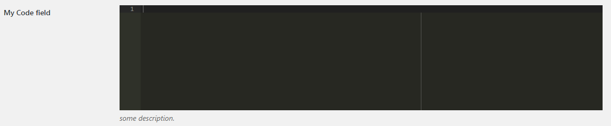
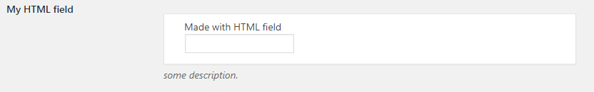
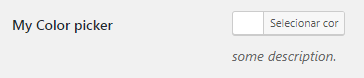
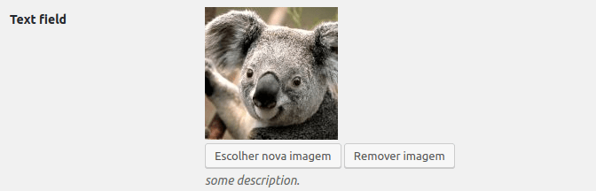

# Better WordPress Admin API Documentation

## Field types

- [Text](#text)
- [Select](#select)
- [Checkbox](#checkbox)
- [Multiple Checkboxes](#multiple-checkboxes)
- [Radio](#radio)
- [Hidden](#hidden)
- [Code](#code)
- [HTML](#html)
- [Color](#color)
- [Content](#content)
- [Image](#content)

### Text



```php
$the_page->add_field([

    //'tab' => 'default',

    'type'    => 'text',
    'id'      => 'text_field',
    'label'   => __( 'My Text field' ),
    'desc'    => __( 'some description.' ),
    'default' => '',

    //'wrapper_class' => '',

    'props'   => [
        // input properies
        // 'placeholder' => 'type your text',
        // 'type'        => 'number',
        // 'class'       => 'small-text my-class',
        // ...
    ],

    //'before'  => 'html rendered before <input>',
    //'after'   => 'html rendered after <input>',

    //'sanitize_callback' => 'custom_callback_to_sanitize_this_field',
]);
```

### Select



```php
$the_page->add_field([

    //'tab' => 'default',

    'type'    => 'select',
    'id'      => 'select_field',
    'label'   => __( 'My Select field' ),
    'desc'    => __( 'some description.' ),
    'default' => '',

    //'wrapper_class' => '',

    'choices'   => [
        'opt-1'             => 'Option',
        'My option group'   => [
            'opt-2'         => 'Another Option'
        ],
    ],

    //'before'  => 'html rendered before <select>',
    //'after'   => 'html rendered after </select>',

    //'sanitize_callback' => 'custom_callback_to_sanitize_this_field',
]);
```

### Checkbox



```php
$the_page->add_field([

    //'tab' => 'default',

    'type'    => 'checkbox',
    'id'      => 'checkbox_field',
    'label'   => __( 'My Checkbox field' ),
    'desc'    => __( 'some description.' ),
    'default' => '',

    //'wrapper_class' => '',

    //'before'  => 'html rendered before the checkbox',
    'after'   => 'html rendered after the checkbox',

    //'sanitize_callback' => 'custom_callback_to_sanitize_this_field',
]);
```

Notes:

- A checked checkbox will saved as `'on'`. If you need a checkbox checked by default, use `'default' => 'on'`.
- To put a label after the checkbox, use an "after" parameter: `'after' => 'my checkbox label'`

### Multiple Checkboxes



```php
$the_page->add_field([

    //'tab' => 'default',

    'type'    => 'checkbox_multi',
    'id'      => 'checkbox_multi_field',
    'label'   => __( 'My Multiple Checkboxes field' ),
    'desc'    => __( 'some description.' ),
    // separate the default values with a comma
    //'default' => 'banana, apple',

    //'wrapper_class' => '',

    'choices' => [
        'banana'    => 'Banana',
        'apple'     => 'Apple',
        'orange'    => 'Orange',
    ],

    //'before'  => 'html rendered before all checkboxes',
    //'after'   => 'html rendered after all checkboxes',

    //'sanitize_callback' => 'custom_callback_to_sanitize_this_field',
]);
```

Notes:

- The checked checkboxes will saved into a `Array`.

### Radio



```php
$the_page->add_field([

    //'tab' => 'default',

    'type'    => 'radio',
    'id'      => 'radio_field',
    'label'   => 'My Radio fields',
    'desc'    => 'some description.',
    'default' => '',

    //'wrapper_class' => '',

    'choices'   => [
        'BR'    => 'Brazil',
        'SV'    => 'El Salvador',
        'DE'    => 'Germany',
        'IT'    => 'Italy',
    ],

    //'before'  => 'html rendered before the radio input',
    //'after'   => 'html rendered after the radio input',

    //'sanitize_callback' => 'custom_callback_to_sanitize_this_field',
]);
```

### Hidden


```php
$the_page->add_field([

    //'tab' => 'default',

    'type'    => 'hidden',
    'id'      => 'hidden_field',
    'default' => '',

    //'wrapper_class' => '',

    //'before'  => 'html rendered before the <input>',
    //'after'   => 'html rendered after the <input>',

    //'sanitize_callback' => 'custom_callback_to_sanitize_this_field',
]);
```

### Code

Code editor powered by [ace](https://ace.c9.io/).



```php
$the_page->add_field([

    //'tab' => 'default',

    'type'    => 'code',
    'id'      => 'code_field',
    'label'   => 'My Code field',
    'desc'    => 'some description.',
    'default' => '',

    //'wrapper_class' => '',

    //'lang'              => 'javascript',
    //'theme'             => 'monokai',
    //'height'            => 200,
    //'font-size'         => 12,
    //'tab-size'          => 4,
    //'soft-tab'          => false,
    //'read-only'         => false,
    //'show-print-margin' => true

    //'before'  => 'html rendered before the code editor',
    //'after'   => 'html rendered after the code editor',

    //'sanitize_callback' => 'custom_callback_to_sanitize_this_field',
]);
```

Notes:

- List of all *themes* and *modes* (languages): https://github.com/ajaxorg/ace-builds/tree/master/src

### HTML



```php
$the_page->add_field([

    //'tab' => 'default',

    'type'    => 'html',
    'id'      => 'html_field',
    'label'   => 'My HTML field',
    'desc'    => 'some description.',
    'default' => '',

    //'wrapper_class' => '',

    'content' => 'custom_render_html_field', // to use a function renderer
    // or render with template variables
    // 'content' => '<input name="{id}" value="{value}" type="text">'

    //'sanitize_callback' => 'custom_callback_to_sanitize_this_field',
]);

function custom_render_html_field ( $field, $the_page ) {
    $value = $the_page->get_field_value( $field['id'] );
    $html = '<div class="card">Made with HTML field<br>';
    $html .= '<input type="text" name="' . $field['id'] . '" value="' . esc_attr( $value ) . '">';
    $html .= '</div>';
    echo $html;
}
```

Notes:

- `html` fields don't has `before` or `after` parameters.

### Color



```php
$the_page->add_field( [
    //'tab' => 'default',

    'type'    => 'color',
    'id'      => 'color_field',
    'label'   => 'My Color picker',
    'desc'    => 'some description.',
    'default' => '#fff',

    //'wrapper_class' => '',

    //'before'  => 'html rendered before the color picker',
    //'after'   => 'html rendered after the color picker',

    //'sanitize_callback' => 'custom_callback_to_sanitize_this_field',
] );
```

### Content

TinyMCE content editor.


```php
$the_page->add_field( [
    //'tab' => 'default',

    'type'    => 'content',
    'id'      => 'content_field',
    'label'   => 'My Content picker',
    'desc'    => 'some description.',
    'default' => '',

    //'wrapper_class' => '',

    //'height'  => 200,
    //'wpautop' => true,

    //'before'  => 'html rendered before the editor',
    //'after'   => 'html rendered after the editor',

    //'sanitize_callback' => 'custom_callback_to_sanitize_this_field',
] );
```

### Image

Image uploader.



```php
$the_page->add_field( [
    //'tab' => 'default',

    'type'    => 'image',
    'id'      => 'image_field',
    'desc'    => 'some description.',

    //'wrapper_class' => '',

    //'field_button_upload'  => 'Upload new image',
    //'field_button_remove' => 'Remove image',
    //'uploader_title'  => 'Upload a image',
    //'uploader_button' => 'Use this image',

    //'before'  => 'html rendered before the editor',
    //'after'   => 'html rendered after the editor',

    //'sanitize_callback' => 'custom_callback_to_sanitize_this_field',
] );
```
